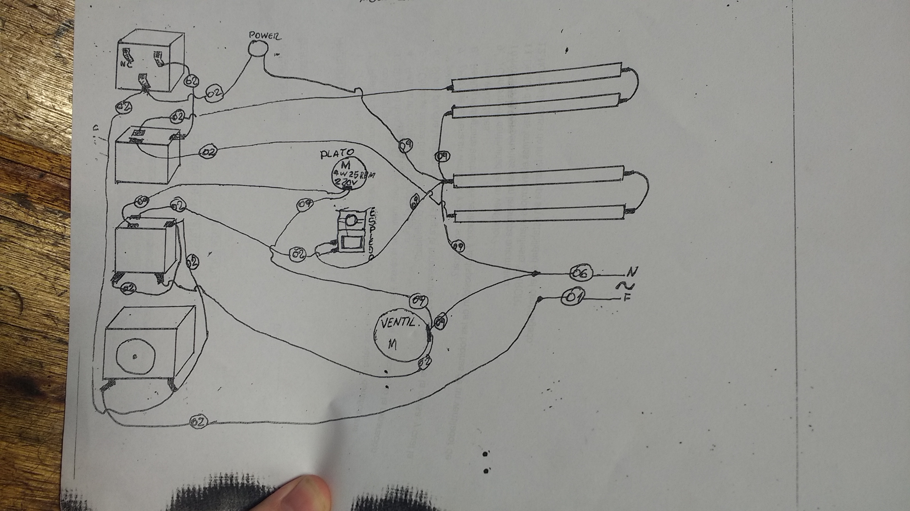
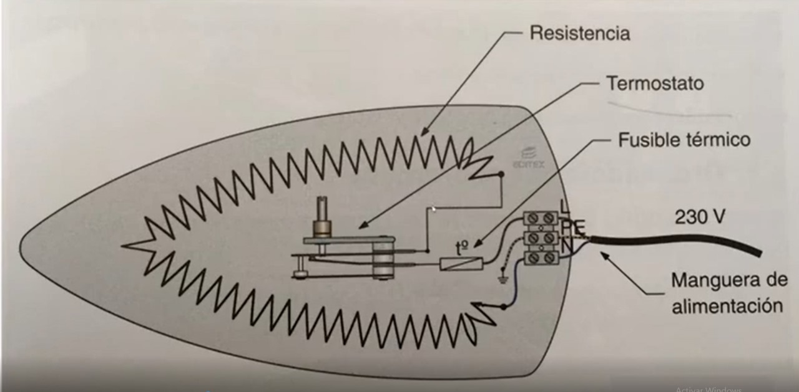
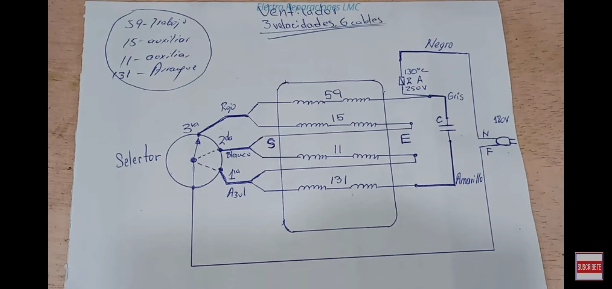

---
title:
- Exámen Electrodomésticos.
theme:
- Copenhagen
---

# Que es un electrodoméstico?

Los electrodomésticos son aparatos eléctricos diseñados para facilitar tareas en el hogar, como cocinar, limpiar y conservar alimentos. Ejemplos incluyen frigoríficos, hornos y lavadoras. Estos dispositivos son esenciales en la vida cotidiana, ya que permiten realizar actividades de manera más eficiente.

---

# ¿Qué es la línea marrón?

Se refiere a los electrodomésticos relacionados con el entretenimiento y la comunicación, como televisores, equipos de audio y computadoras.

---

# ¿Qué es la línea blanca?

Engloba los electrodomésticos utilizados principalmente en la cocina y la limpieza del hogar, como neveras, lavadoras y cocinas.

---

# Nombre grandes electrodomésticos.

Los grandes electrodomésticos incluyen:

* Frigoríficos
* Lavadoras
* Secadoras
* Cocinas
* Lavavajillas

---

# Nombra pequeña aplicación de electrodomésticos

* Batidoras
* Cafeteras
* Tostadoras
* Afeitadoras
* Freidoras

---

# Realiza un circuito eléctrico de una estufa eléctrica halógena de tres velas e identifica sus componentes.

El horno eléctrico es una replica de una estufa

---

# Si una o más velas no encienden, menciona la causa, y cuál sería la solución y/o la reparación.

Las resistencias pueden estar quemadas o dañadas, un cable suelto o mal conectado puede interrumpir el flujo eléctrico hacia las resistencias. Puede haber problemas con la alimentación eléctrica, como un mal contacto en el enchufe o en el cableado interno del horno. Avería en el Termostato. El termostato controla velas y temperatura, y el temporizador controla el encendido del horno. Solución: Revisar todo eso y reemplazar o reparar lo dañado.

---

# Realiza un circuito de una plancha eléctrica.

---

# ¿Cómo se realiza una medición de continuidad?

Para medir continuidad:

1. Desconectar el aparato.
1. Usar un multímetro en modo de continuidad.
1. Colocar las puntas del multímetro en los extremos del componente a medir.

---

# Si una plancha funciona pero no se logra la temperatura adecuada, nombre la causa, y cual es la solución.

* Causa: Termostato defectuoso.
* Solución: Reemplazar el termostato.

---

# ¿Por qué se frena un ventilador y cómo solucionar?
Un ventilador puede frenarse por:

* **Causa**: Acumulación de polvo o un motor defectuoso, falta de lubricación, internas dañadas, como rodamientos o el mismo eje, esto puede causar fricción excesiva y eventual bloqueo del ventilador. fallo en componentes eléctricos, como el capacitor del motor, puede hacer que el ventilador no arranque correctamente o se detenga después de un corto tiempo. Deformación del Buje: Con el uso y la exposición al calor, el buje puede deformarse, lo que reduce el espacio entre él y el eje. Esto provoca un bloqueo que impide que el ventilador gire.    
* **Solución**: Limpiar el ventilador y verificar el motor. Limpiar y Lubricar: Limpiar cualquier residuo acumulado y aplicar un lubricante adecuado puede ayudar a restaurar la funcionalidad del ventilador. Reemplazar Componentes Dañados: Si se identifica desgaste en los bujes o ejes, es recomendable reemplazarlos para evitar futuros problemas.

---

# Realiza el diagrama eléctrico del ventilador y la disposición de las bobinas de un ventilador de tres velocidades.

---

# ¿Cómo medir continuidad de un ventilador?
La medición se realiza igual que con la plancha, usando un multímetro para verificar si hay flujo eléctrico a través del motor.   

* Desconectar el Ventilador:
* Acceder a la Bobina:
* Configurar el Multímetro: Ajusta el multímetro en la función de prueba de continuidad. Este modo a menudo se indica con un símbolo de diodo o un sonido (pitido) que se activa al detectar continuidad.
* Conecta las puntas del multímetro a los terminales de la bobina o al componente que deseas probar. 
* Realizar la Medición: Si el multímetro emite un pitido o muestra un valor cercano a cero, significa que hay continuidad y el componente está en buen estado.
* Si no hay sonido o muestra “OL” (circuito abierto), indica que no hay continuidad, lo que sugiere que el componente está defectuoso y necesita ser reemplazado.

---

# ¿Por qué motivo un secador de ropa centrífugo no arranca?

* **Causa**: contactos del interruptor están cubiertos de carbón o suciedad. Blocapuertas, problemas eléctricos el cable de alimentación no está en buen estado o los fusibles o interruptores en el panel eléctrico no están disparados, fallos en el motor debido a suciedad o desgaste o bloqueo mecánico. Si la bobina de trabajo está dañada, el motor no podrá arrancar.    
* **Solución**: Revisar conexiones eléctricas y asegurarse que no haya obstrucciones.

---

# Nombra los componentes de un lavarropas semiautomático.

* Cuba de Lavado: Donde se coloca la ropa y el agua para el lavado.
* Cuba de Centrifugado: Separada de la cuba de lavado, es donde se centrifuga la ropa.
* Motor: Proporciona la energía necesaria para el movimiento del agitador y la centrifugadora.
* Agitador: Elemento que mueve la ropa dentro de la cuba para facilitar el lavado.
* Toma de Agua: Conectada a la red de agua, permite llenar la cuba manualmente.
* Válvula de Desagüe: Permite vaciar el agua después del lavado.
* Control Manual: Botones o perillas para seleccionar el ciclo de lavado y centrifugado.
* Filtro de Pelusa: Captura pelusa y residuos durante el lavado.

---

# Si un lavarropas semiautomático ajustamos el tiempo de lavado y el motor no arranca, menciona la causa y la solución.

El temporizador está defectuoso. Solución: Reemplazar el temporizador.

---

# Nombra los componentes de un lavarropa automático.

Cuba de Lavado. Cuba de Centrifugado. Motor: Más sofisticado que el semiautomático, a menudo con variaciones en velocidad y dirección. Agitador o Tambor. Electroválvulas: Controlan automáticamente el llenado y vaciado de agua según los ciclos programados. Sensor de Carga (Presostato): Detecta el nivel del agua y ajusta automáticamente el llenado. Panel de Control Electrónico. Bomba de Desagüe. Termostato: Regula la temperatura del agua durante el lavado. Módulo de Potencia: Controla la energía eléctrica que se suministra a los componentes eléctricos.

---

# De que distintas formas el lavarropas manifiesta “ERROR”

Los lavarropas pueden manifestar "ERROR" de diversas formas, generalmente a través de códigos en el panel de control o mediante señales auditivas. A continuación se detallan las formas más comunes en que un lavarropas puede indicar un error:   

1. Diferentes Códigos de Error
2. Señales Auditivas
Algunos modelos emiten pitidos o sonidos específicos como parte del sistema de aviso. Por ejemplo:
Un pitido puede indicar un error menor o que el ciclo ha terminado.
Dos pitidos pueden señalar problemas más serios, como fallos en el drenaje.
3. Luces Intermitentes
Los lavarropas a menudo utilizan luces intermitentes para indicar errores. Por ejemplo:
Una luz parpadeante puede señalar que hay un problema con el ciclo actual o un componente específico.
4. Mensajes en Pantalla.
5. Comportamiento Anómalo.

---

# Detalla la tabla de errores.

| **Código de Error**  | **Descripción**                                        | **Posibles Soluciones**                                                                                    |
|----------------------|--------------------------------------------------------|------------------------------------------------------------------------------------------------------------|
| **IE**               | Falla en el suministro de agua.                        | Verifique la entrada de agua, asegúrese de que las mangueras no estén dobladas o bloqueadas.               |
| **OE**               | Error en el drenaje.                                   | Compruebe la bomba de drenaje y el filtro. Asegúrese de que la manguera de drenaje no esté obstruida.      |
| **UE**               | Desequilibrio en la carga.                             | Reorganice la ropa en el tambor para equilibrar la carga.                                                  |
| **LE**               | Error en el cierre de puerta.                          | Asegúrese de que la puerta esté cerrada correctamente y verifique el interruptor de bloqueo.               |
| **E1**               | Problema en el drenaje.                                | Revise la bomba de desagüe y el cableado, y asegúrese de que el sensor de nivel funcione correctamente.    |
| **E2**               | Sobrellenado.                                          | Cierre la válvula de entrada de agua y revise el sensor de nivel o interruptor de presión.                 |
| **E3**               | Error en el ventilador (en modelos lavadora-secadora). | Verifique si hay obstrucciones en el motor del ventilador y asegúrese de que funcione correctamente.       |
| **E4**               | Error general (requiere asistencia técnica).           | Desenchufe el aparato y llame al servicio técnico para una revisión completa.                              |
| **H4**               | Sobrecalentamiento durante el lavado.                  | Verifique el nivel del agua y el sensor de temperatura; desconecte y llame al servicio técnico si persiste.|
| **PE F**             | Filtro bloqueado.                                      | Limpie o reemplace el filtro según sea necesario.                                                          |
| **FE**               | Alta presión en suministro de agua.                    | Reduzca el caudal ajustando la llave del agua o llame a un técnico si persiste el problema.                |

---

# Detalla las conexiones en una placa de lavarropas automático.

Microcontrolador, Relé de Control, Electroválvulas, Sensor de Carga, Sensor de Temperatura, Interruptor de Puerta, Motor, Display LED/LCD, Conectores de Alimentación, Fusible

**Conexiones Típicas**
* Conexiones del Motor: Conectores para las bobinas del motor (arranque y trabajo).  Terminales que van al interruptor centrífugo.
* Conexiones de Electroválvulas: Terminales para electroválvulas que controlan el llenado de agua.  Cada válvula tiene conexiones separadas para agua caliente y fría.
* Conexiones del Sensor de Carga: Conectores que envían señales al microcontrolador sobre el nivel de agua.
* Conexiones del Sensor de Temperatura: Terminales que permiten medir la temperatura del agua.
* Conexiones del Interruptor de Puerta: Conectores que aseguran la operación segura del lavarropas.
* Conexiones del Display: Terminales para conectar el display que muestra información al usuario.

---

# Realiza un circuito de comprobación de lavarropa.

La placa antes de arrancar comprueba el blocapuertas, comprueba la electroválvula (carga y saca el agua), comprueba el presostato, y comprueba la bomba de agua.
¿O sea el circuito que me está pidiendo es el circuito del lavarropas?

---

# Nombra la causa de un lavarropa sin estabilidad en el centrifugado.

* Carga Desbalanceada:Si la ropa está mal distribuida dentro del tambor, puede causar que el lavarropas se sacuda excesivamente. 
* Exceso de Carga.
* Desgaste en Componentes Mecánicos:
* El desgaste en la base de la canasta o en el sistema de transmisión puede resultar en movimientos inusuales durante el centrifugado. 
* Condensador de Arranque Deteriorado
* Problemas con el Motor: Si las escobillas están desgastadas. Si hay obstrucciones en el tubo de desagüe, esto puede causar que el agua no se elimine adecuadamente, afectando el equilibrio durante el centrifugado.
* Fallo en los Amortiguadores
